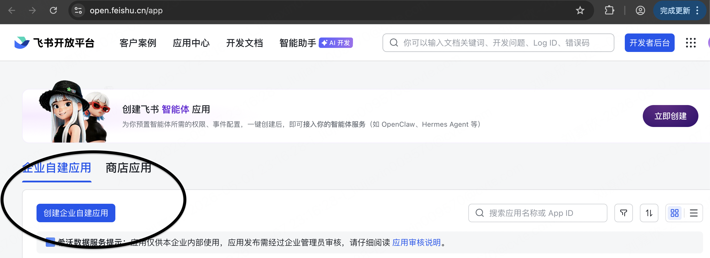
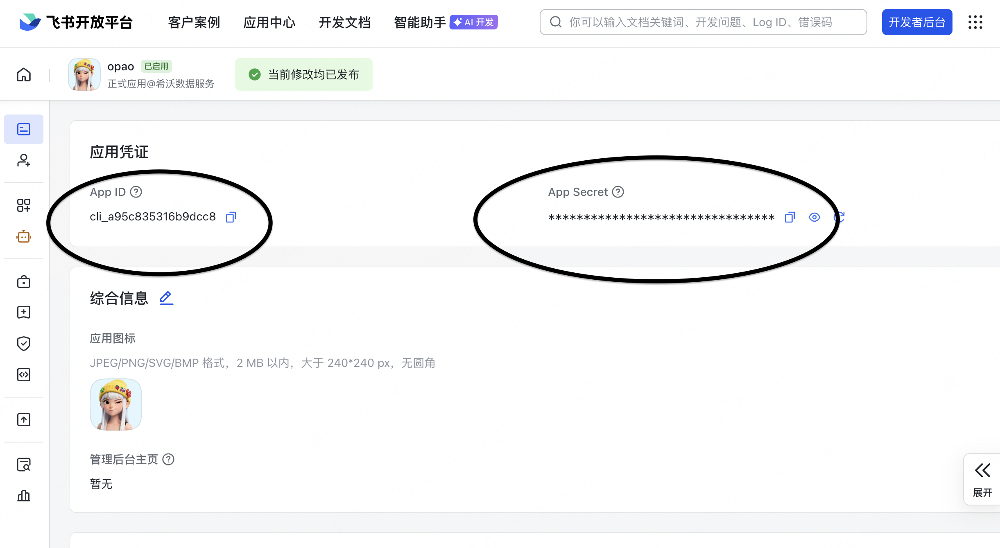
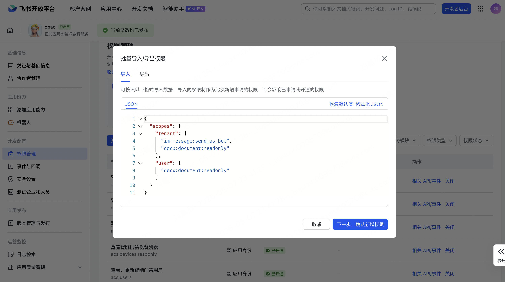
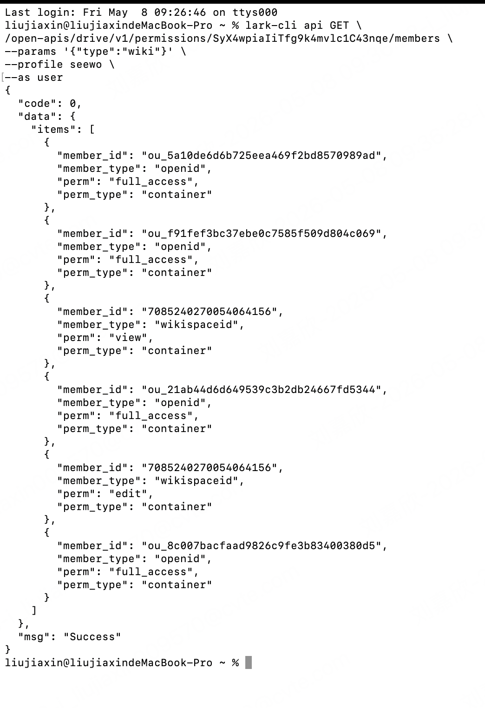
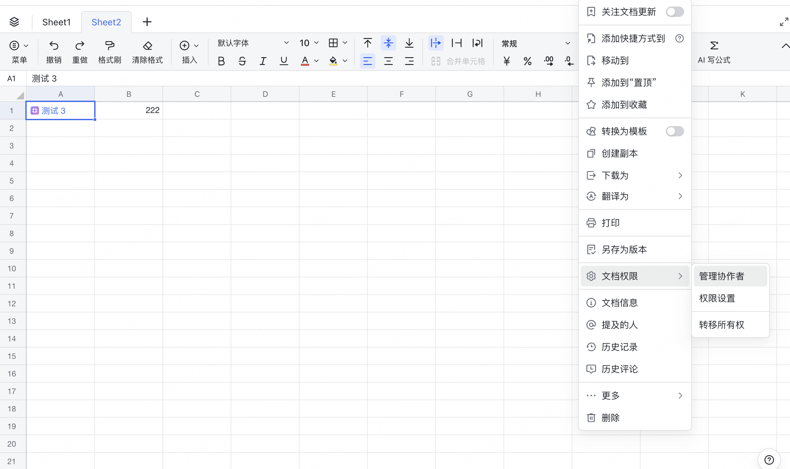
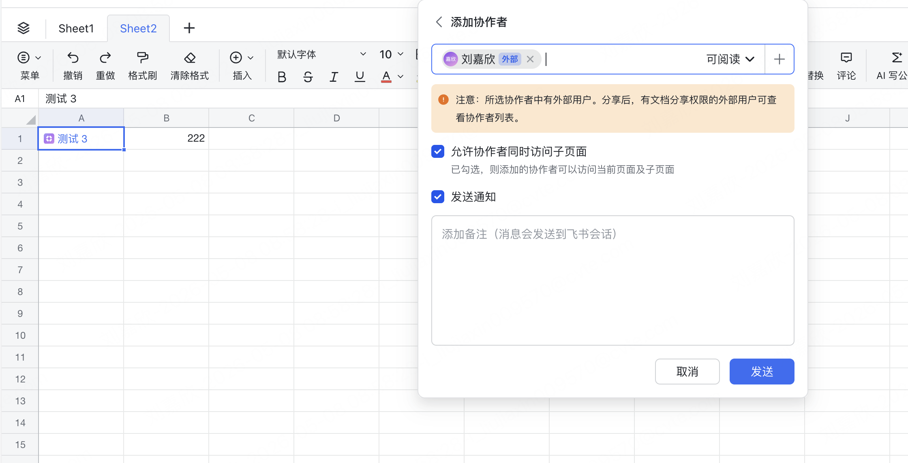
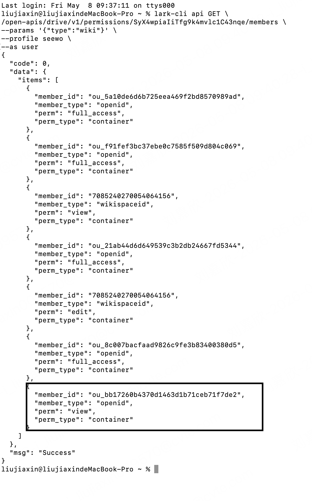

# wiki-cross-tenant

跨租户飞书 wiki 迁移 —— 走"添加协作者 + 服务端副本"路径，无损保留 docx/doc/sheet/bitable/mindnote 等所有原生类型，**源文档的密码和分享设置完全不变**。

**基本概念：**

- **源租户** = 文档现在所在的组织（要从这里迁出去）
- **目标租户** = 文档要迁入的组织

操作时需要用**两个浏览器**（或一个浏览器的正常模式 + 无痕模式）分别登录源端和目标端。

## 前置准备

跨租户迁移需要源/目标两个租户各有一个**自建应用** + **足够的 user 身份 scope**。漏一项就跑不通，按下面 1-8 步依次完成。

### 1. 安装 lark-cli

参考 [larksuite/cli](https://github.com/larksuite/cli) 安装。装完执行 `lark-cli --help` 能看到帮助即可。

### 2. 创建自建应用

分别用源端和目标端的账号登录飞书开放平台 <https://open.feishu.cn/app>，各「创建企业自建应用」：



拿到两份 `App ID` + `App Secret`，后面要用：



### 3. 配置 lark-cli profile

用第 2 步拿到的 App ID / Secret 分别创建两个 profile：

```bash
lark-cli config init --name seewo   # 源租户：填源端应用的 App ID / Secret
lark-cli config init --name xupt    # 目标租户：填目标端应用的 App ID / Secret
```

> profile 名字可以自定义（比如用组织名），后面所有命令里的 `seewo` / `xupt` 替换成你自己起的名字。

### 4. 申请 scope 并发版

在飞书开放平台后台，源端和目标端应用分别打开「权限管理」→「批量导入/导出权限」，粘贴对应的 JSON 导入。

<details>
<summary><strong>源端应用 scope（点击展开）</strong></summary>

```json
{
  "scopes": {
    "tenant": [],
    "user": [
      "wiki:wiki",
      "wiki:node:copy",
      "wiki:node:read",
      "wiki:node:retrieve",
      "wiki:space:read",
      "wiki:space:retrieve",
      "docs:permission.member:create",
      "docs:permission.member:delete",
      "docs:permission.member:retrieve",
      "docs:permission.setting:write_only",
      "docs:permission.setting:read",
      "docs:document.content:read",
      "docs:document.comment:read",
      "docs:document.comment:create",
      "docs:document.comment:write_only",
      "docs:document.comment:update",
      "docs:document.media:download",
      "docs:document.media:upload",
      "docx:document:readonly",
      "docx:document:write_only",
      "sheets:spreadsheet:read",
      "sheets:spreadsheet:write_only",
      "bitable:app",
      "contact:contact.base:readonly",
      "contact:user.base:readonly",
      "contact:user.basic_profile:readonly"
    ]
  }
}
```

</details>

<details>
<summary><strong>目标端应用 scope（点击展开）</strong></summary>

```json
{
  "scopes": {
    "tenant": [],
    "user": [
      "wiki:wiki",
      "wiki:node:copy",
      "wiki:node:read",
      "wiki:node:retrieve",
      "wiki:space:read",
      "wiki:space:retrieve",
      "docs:permission.setting:write_only",
      "docs:document.content:read",
      "docs:document.comment:read",
      "docs:document.comment:create",
      "docs:document.comment:write_only",
      "docs:document.comment:update",
      "docs:document.media:download",
      "docs:document.media:upload",
      "docx:document:readonly",
      "docx:document:write_only",
      "sheets:spreadsheet:read",
      "sheets:spreadsheet:write_only",
      "bitable:app",
      "contact:contact.base:readonly",
      "contact:user.base:readonly",
      "contact:user.basic_profile:readonly"
    ]
  }
}
```

</details>

在「权限管理」页面导入：



导入后必须**到「版本管理与发布」→ 创建版本 → 提交发布**（等审核通过）。看到 scope 状态变成「**已开通**」才算生效。

### 5. 互相添加为外部联系人

源租户和目标租户的操作用户必须**互为外部联系人**，否则跨租户添加协作者会失败。

在飞书移动端，点击头像 → 设置 → 隐私 → 添加我的方式，查看手机号：


切换到另一个组织，点右上角加号 → 添加外部联系人，用手机号搜索并添加：


**两边都要操作一次**（A 加 B，B 也要加 A）。

### 6. user 身份登录

终端运行下面两条命令，分别在对应的浏览器会话中点「授权」：

```bash
# 源端登录
lark-cli auth login --profile seewo --scope "docs:permission.setting:write_only docs:permission.setting:read docs:permission.member:create docs:permission.member:delete docs:permission.member:retrieve docs:document.content:read docs:document.comment:read docs:document.comment:write_only docs:document.comment:create docs:document.comment:update docs:document.media:download docs:document.media:upload docx:document:readonly docx:document:write_only sheets:spreadsheet:read sheets:spreadsheet:write_only bitable:app wiki:wiki wiki:node:copy wiki:node:read wiki:node:retrieve wiki:space:read wiki:space:retrieve contact:user.base:readonly contact:user.basic_profile:readonly contact:contact.base:readonly offline_access"

# 目标端登录
lark-cli auth login --profile xupt --scope "docs:permission.setting:write_only docs:document.content:read docs:document.comment:read docs:document.comment:write_only docs:document.comment:create docs:document.comment:update docs:document.media:download docs:document.media:upload docx:document:readonly docx:document:write_only sheets:spreadsheet:read sheets:spreadsheet:write_only bitable:app wiki:wiki wiki:node:copy wiki:node:read wiki:node:retrieve wiki:space:read wiki:space:retrieve contact:user.base:readonly contact:user.basic_profile:readonly contact:contact.base:readonly offline_access"
```

> ⚠️ 源端命令在源端浏览器授权，目标端命令在目标端浏览器授权，不要搞混。

### 7. 获取 space id 和 open\_id

迁移命令需要三个关键参数，按下面的方法获取。

**获取源端和目标端的 space id：**

在知识库页面点击左下角设置图标，URL 中的数字串即为 space id：


源端和目标端各操作一次，分别拿到 `source-space` 和 `target-space`。

**获取目标用户在源租户的 open\_id：**

open\_id 是 app-scoped 的（同一个人在不同应用里 open\_id 不同），需要通过对比协作者列表来获取。

① 在源知识库随便找一个 wiki 节点，node\_token 是 URL 里 `/wiki/` 后面的字符串：


② 查看当前协作者列表，记下已有的 `ou_xxx`：

```bash
lark-cli api GET /open-apis/drive/v1/permissions/<NODE_TOKEN>/members \
  --params '{"type":"wiki"}' --profile <源端profile> --as user
```



③ 在源端浏览器打开该文档 → 右上角三个点 → 文档权限 → 搜索目标用户名字 → 添加为协作者：





④ 再次执行同样的命令查协作者列表，对比两次结果，**新增的 `ou_xxx` 就是目标用户在源端的 open\_id**：



⑤ 查完后在飞书文档界面把手动添加的协作者**移除**，保持源文档干净。

### 8. 跑前置自检

```bash
python3 preflight.py \
  --source-profile seewo --target-profile xupt \
  --source-space <源端space_id> --target-space <目标端space_id> \
  --target-member-id <第7步拿到的ou_xxx>
```

> `--source-root` 和 `--target-root` 可以不传，不传则检查整个知识库。

脚本会逐项检查 lark-cli 安装 / profile / token / scope / API 烟雾测试（含协作者添加/移除）。任何一项没过会打印缺什么和怎么修。**全绿**才进入下一步。

## 用法

### 参数说明

| 参数                   | 含义                          | 从哪获取                     |
| -------------------- | --------------------------- | ------------------------ |
| `--source-profile`   | 源端 lark-cli profile 名       | 第 3 步你自己起的名字             |
| `--target-profile`   | 目标端 lark-cli profile 名      | 第 3 步你自己起的名字             |
| `--source-space`     | 源端知识库 space id              | 第 7 步从 URL 获取            |
| `--target-space`     | 目标端知识库 space id             | 第 7 步从 URL 获取            |
| `--source-root`      | 源端要迁移的根节点 node\_token（可选）   | URL 里 `/wiki/` 后面的字符串    |
| `--target-root`      | 目标端要挂载到的父节点 node\_token（可选） | URL 里 `/wiki/` 后面的字符串    |
| `--source-domain`    | 源端飞书域名                      | 浏览器地址栏，如 `xxx.feishu.cn` |
| `--target-domain`    | 目标端飞书域名                     | 浏览器地址栏，如 `yyy.feishu.cn` |
| `--target-member-id` | 目标用户在源端的 open\_id           | 第 7 步对比获取                |

> **`--source-root`** **不传** = 迁移整个源知识库的所有文档。传了 = 只迁移该节点及其子树。
> **`--target-root`** **不传** = 复制到目标知识库的顶层。传了 = 复制到该节点下面。

### 开始迁移

#### 一键迁移（推荐）

使用 `sync.py` 一键完成全部步骤（复制 → 链接改写 → 评论迁移 → 生成报告），任何一步失败自动停止：

```bash
cd ~/Desktop/wiki-cross-tenant

python3 sync.py \
  --source-profile seewo --target-profile xupt \
  --source-space <源端space_id> --target-space <目标端space_id> \
  --source-domain xxx.feishu.cn \
  --target-domain yyy.feishu.cn \
  --target-member-id <第7步拿到的ou_xxx>
```

> 如果只迁移某个子树，加 `--source-root <node_token>`；要挂到目标端某个节点下面，加 `--target-root <node_token>`。

#### 增量同步

首次全量迁移完成后，保留 `state/` 目录，再次运行**相同的命令**即自动进入增量模式。增量会自动处理：

- **新增节点** — 复制到目标端对应位置
- **删除节点** — 目标端对应节点移入 `_迁移回收站`
- **内容/标题变更** — 旧副本移入回收站，重新复制
- **位置移动** — 目标端节点跟随移动到新位置

增量完成后，目标端除多一个 `_迁移回收站` 节点外，结构与源端保持一致。

> ⚠️ 每次增量同步后，请在目标知识库中手动删除 `_迁移回收站` 节点（删除此页面和它包含的所有子页面）。不删也不影响下次增量运行。

#### 分步运行

如果需要单独执行某一步，也可以分步运行：

**1) 扫描源（可选，看看有多少节点）**

```bash
python3 share-copy.py scan \
  --source-profile seewo \
  --source-space <源端space_id>
```

**2) 实际迁移**

```bash
python3 share-copy.py run \
  --source-profile seewo --target-profile xupt \
  --source-space <源端space_id> --target-space <目标端space_id> \
  --source-domain xxx.feishu.cn \
  --target-domain yyy.feishu.cn \
  --target-member-id <第7步拿到的ou_xxx>
```

**3) 改写文档中指向源端的链接**

```bash
python3 fix-mentions.py
```

**4) 迁移评论**

```bash
python3 migrate-comments.py
```

**5) 汇总报告**

```bash
python3 report.py
open state/report.html
```

**6) 清理残留协作者（仅在迁移中断时需要）**

```bash
python3 share-copy.py cleanup
```

## state 目录

- `mapping.json`         —— 全部映射 + 失败明细，**断点续传和增量同步依赖此文件**
- `source-tree.json`     —— BFS 缓存
- `mentions-report.json` —— 链接改写统计
- `comments-report.json` —— 评论迁移统计
- `report.html`          —— 汇总报告

## Output Files

The tool writes the following under the run directory:

- migration-summary.json - per-space migration counts and failures
- mentions-report.json - cross-tenant link rewrites applied
- 
eport.html - browsable HTML summary of the run

